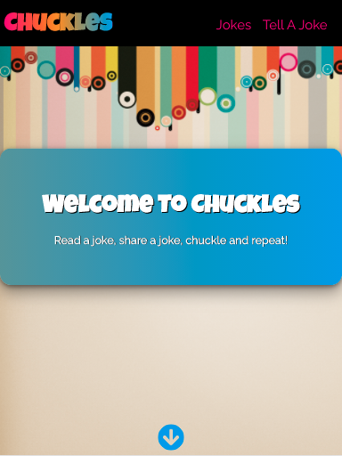
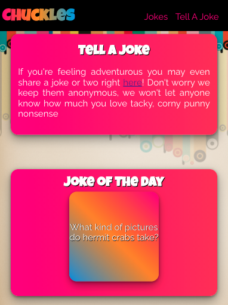
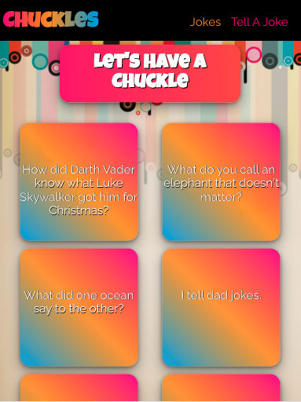
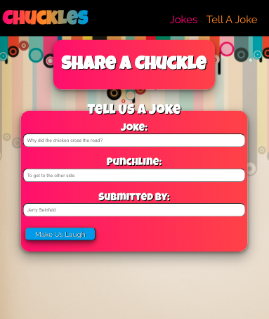

# Chuckles

## Summary:

Chuckles is a client-side React web app that lets users see and share dad jokes. It was built to use an API, which can be viewed [here](https://github.com/CaitlinGreer/chuckles-api.git). 

## Technology:

Chuckles was made using a server-side program that can be found here:
* [Chuckles-Api](https://github.com/CaitlinGreer/chuckles-api.git)

Details:
* React
* CSS
* PostgreSQL
* Node.js
* Express

## Check Out the Live Version:

[Chuckles](https://chuckles-app-caitlingreer.vercel.app/)

## Screenshots

### Home Page

 

### Jokes Page

### Add A Joke Form Page

